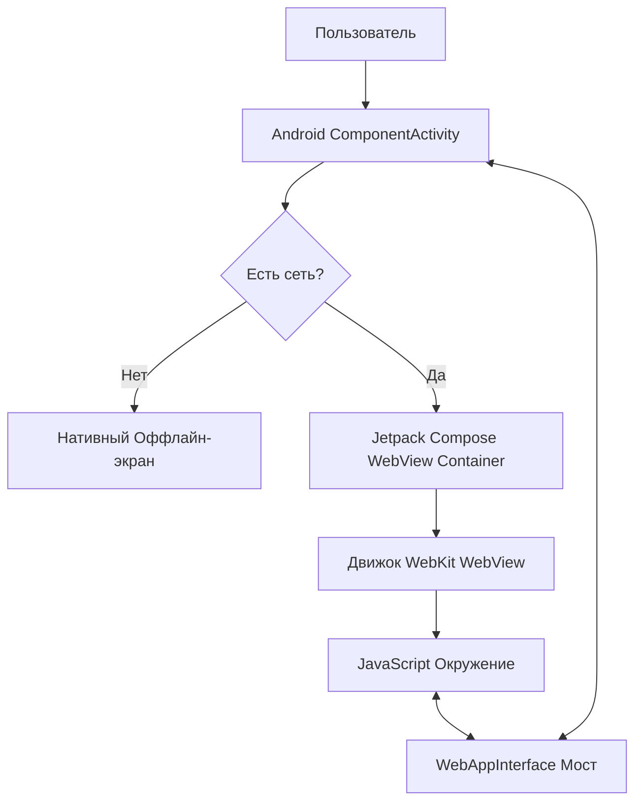

# Технический план: Гибридное ядро приложения (001-core-hybrid-shell)

## 1. Технологический стек и архитектура

В соответствии с Принципом 2 Конституции проекта, нативный контейнер Android и веб-среда полностью изолированы друг от друга и взаимодействуют только через строго типизированный слой контрактов.

### Нативная часть (Android)
- **Язык разработки:** Kotlin 1.9+
- **Интерфейс (UI):** Jetpack Compose для нативных компонентов (экран загрузки, оффлайн-экран, контейнер WebView).
- **Компонент WebView:** `android.webkit.WebView` с интеграцией через `AndroidView` в Compose.
- **Управление жизненным циклом и навигацией:** `ComponentActivity`, Jetpack `OnBackPressedDispatcher` для перехвата системной кнопки «Назад».
- **Работа с разрешениями и галереей:** Modern Android Activity Result API (`ActivityResultContracts.PickVisualMedia`).

### Веб-часть (Фронтенд / Бэкенд)
- **Слой интеграции:** Стандартный JavaScript (ES6+), доступный глобально в контексте `window`.
- **Протокол связи:** Двунаправленный синхронно-асинхронный мост через внедрение объекта (`@JavascriptInterface`).

---

## 2. Архитектура взаимодействия (Компоненты)

---

## 3. Этапы и фазы реализации

### Фаза 0: Проектирование контрактов и моделей данных (Текущая)
- [x] Определение архитектурных компонентов.
- [ ] Описание схем взаимодействия и контрактов JS-моста.
- [ ] Фиксация моделей состояний и данных.

### Фаза 1: Инфраструктурная настройка (Setup)
- Создание структуры модулей в `android/` (настройка `build.gradle.kts`, подключение Compose и Core-библиотек).
- Настройка `AndroidManifest.xml` (разрешения на доступ к Интернету, конфигурация `HardwareAcceleration`).

### Фаза 2: Реализация базового контейнера и экранов состояний
- Разработка нативного Compose Splash-экрана / индикатора загрузки.
- Разработка нативного Compose Оффлайн-экрана с обработкой кнопки «Повторить попытку».
- Интеграция `WebView` в иерархию Compose с базовыми настройками безопасности (отключение файлового доступа к локальной ФС, включение `javaScriptEnabled`).

### Фаза 3: Реализация JavaScript-моста и Галереи
- Создание класса `WebAppInterface` с методами передачи сессий и контекста.
- Реализация `WebChromeClient.onShowFileChooser` с использованием `PickVisualMedia` контракта для безопасного доступа к фото без избыточных runtime-разрешений.
- Интеграция перехватчика `onBackPressedDispatcher` для управления историей WebView.

### Фаза 4: Верификация и тестирование
- Покрытие нативными тестами перехвата сетевых ошибок.
- Тестирование моста с помощью mock-страниц.
