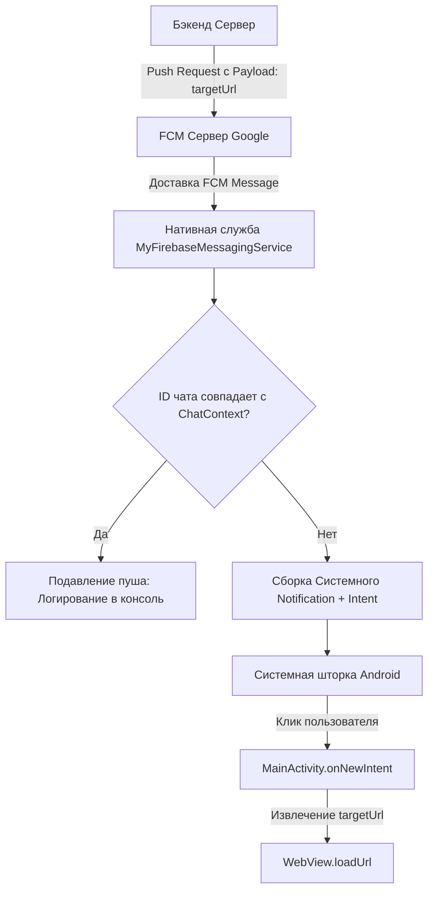

# Технический план: Система Push-уведомлений и FCM (002-push-notifications)

## 1. Архитектурный стек и интеграция

Для реализации push-уведомлений используется официальный стек Firebase Cloud Messaging (FCM) в интеграции с нативной Android-архитектурой и JavaScript-мостом.

### Изменения в инфраструктуре сборки
- **Корневой build.gradle.kts:** Подключение плагина Google Services (`com.google.gms.google-services`) версии `4.4.0+`.
- **Модульный build.gradle.kts (:app):** Подключение плагина Google Services и добавление зависимости `com.google.firebase:firebase-messaging-ktx:23.4.1`.
- **Конфигурация проекта:** Размещение файла `android/app/google-services.json` в корне модуля приложения.

### Нативные компоненты Android
- **Служба сообщений:** `com.google.firebase.messaging.FirebaseMessagingService` для фонового перехвата токенов и входящих трансляций данных (payload).
- **Системные каналы (Android 8.0+):** Создание `NotificationChannel` с высоким приоритетом важности (`IMPORTANCE_HIGH`) для отображения всплывающих баннеров (heads-up notifications).
- **Разрешения (Android 13+):** Использование Compose `RememberPermissionState` или Activity Contracts для запроса `android.permission.POST_NOTIFICATIONS`.

---

## 2. Архитектура потоков данных и маршрутизации

---

## 3. Этапы реализации

### Фаза 0: Проектирование контрактов и моделей данных (Текущая)
- [x] Описание архитектуры плагина и служб.
- [ ] Фиксация формата payload входящих пушей.
- [ ] Проектирование контракта обратного вызова в JavaScript-мост.

### Фаза 1: Подключение Firebase и обновление конфигурации сборки
- Модификация `build.gradle.kts` скриптов.
- Обновление `AndroidManifest.xml` (регистрация фоновой службы, добавление метаданных дефолтного канала уведомлений).

### Фаза 2: Реализация нативной службы FCM
- Создание класса `MyFirebaseMessagingService`.
- Реализация метода `onNewToken` (сохранение в `SharedPreferences` и отправка в мост).
- Реализация метода `onMessageReceived` с проверкой активного контекста чата (`MainViewModel.activeChatId`).

### Фаза 3: Реализация Менеджера уведомлений и Маршрутизации
- Логика сборки `NotificationCompat.Builder` с кастомным `PendingIntent`.
- Обработка входящего интента в `MainActivity.onCreate` и `MainActivity.onNewIntent` для извлечения `targetUrl` и передачи его в WebView контейнер.

### Фаза 4: Реализация Запроса разрешений в Compose UI
- Интеграция runtime-диалога запроса прав на уведомления при старте приложения на Android 13+.
