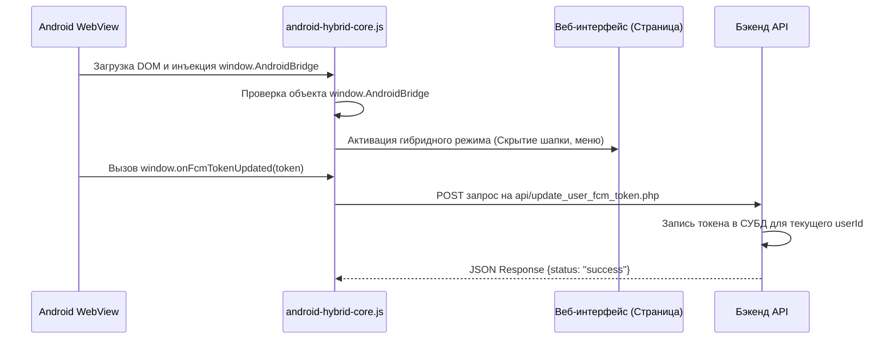

# Технический план: Архитектура бэкенда, API и Веб-ядра (003-web-backend-core)

## 1. Технологический стек и Структура папок

В соответствии с Конституцией проекта и структурой оригинальной кодовой базы, серверная часть реализуется на стабильном веб-стеке, обеспечивающем максимальную скорость ответа API.

### Серверный стек (Бэкенд)
- **Язык разработки:** PHP 8.1+
- **База данных:** MySQL 8.0+ / СУБД с поддержкой стандартного SQL.
- **Интерфейс API:** RESTful JSON API.

### Клиентский стек (Веб-фронтенд)
- **Технологии:** Чистый JavaScript (ES6+), HTML5, CSS3.
- **Адаптивность:** Мобильная верстка под экраны смартфонов с отключением масштабирования (Viewport-изоляция).

### Новая структура директорий в проекте:
```text
backend/
├── config/
│   └── database.php        # Подключение к СУБД
├── api/
│   └── update_user_fcm_token.php  # Эндпоинт привязки пуш-токенов
├── js/
│   └── android-hybrid-core.js     # Скрипт интеграции с Android мостом
├── index.html              # Главная страница веб-интерфейса
├── group.html              # Страница деталей группы / чата
└── database.sql            # Скрипты инициализации таблиц базы данных
```

---

## 2. Архитектура интеграции JS-моста (Последовательность инициализации)



---

## 3. Фазы реализации

### Фаза 0: Проектирование моделей данных и схем API (Текущая)
- [x] Определение структуры серверных папок.
- [ ] Описание SQL-схемы таблиц базы данных.
- [ ] Фиксация формата запросов/ответов API.

### Фаза 1: Развертывание Базы Данных и Конфигурации
- Создание SQL-миграции / файла инициализации базы данных.
- Написание скрипта подключения к СУБД `backend/config/database.php`.

### Фаза 2: Реализация Модуля интеграции моста (Фронтенд)
- Создание файла `backend/js/android-hybrid-core.js`.
- Реализация функций перехвата `window.onFcmTokenUpdated`.
- Внедрение вызовов `window.AndroidBridge.setActiveChat` на страницах навигации (`index.html`, `group.html`).

### Phase 3: Реализация REST API Эндпоинта
- Разработка скрипта `backend/api/update_user_fcm_token.php`.
- Интеграция проверок авторизации сессии и экранирования SQL-параметров.
