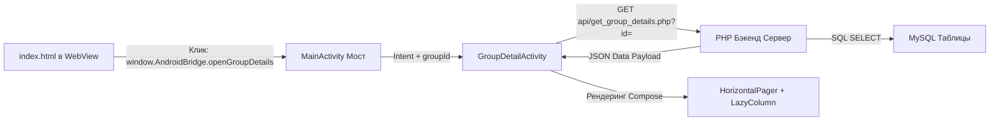

# Технический план: Нативный экран деталей группы и REST API (004-group-details)

## 1. Технический стек и Компоненты UI

Реализация карточки группы разделена между серверным API (выдача данных) и нативным Android-интерфейсом на базе Jetpack Compose.

### Нативная часть (Android)
- **Компонент экрана:** `GroupDetailActivity`, унаследованная от `ComponentActivity`.
- **Архитектура UI:** Jetpack Compose (Material 3).
- **Слайдер фотографий (FR-402):** Нативный Compose `HorizontalPager` из пакета `androidx.compose.foundation.experimental` или стандартного foundation.
- **Список участников (FR-403):** Нативный Compose `LazyColumn` со строками `LazyItemScope` для обеспечения стабильных 60 FPS (`SC-601`).
- **Загрузка сетевых изображений:** Интеграция легковесной библиотеки Coil (`io.coil-kt:coil-compose:2.5.0`) для асинхронного кэширования и плавного рендеринга аватаров и фото групп по URL.

### Серверная часть (Бэкенд)
- **Язык эндпоинта:** PHP 8.1+
- **Интерфейс связи:** REST API GET-запрос с обязательным параметром `id`.

---

## 2. Архитектура передачи контекста и данных

---

## 3. Этапы и Фазы реализации

### Фаза 0: Проектирование контрактов и моделей данных (Текущая)
- [x] Выбор UI-компонентов и Coil-интеграции.
- [ ] Описание комплексной JSON схемы ответа группы.
- [ ] Фиксация SQL схем смежных таблиц MySQL.

### Фаза 1: Развертывание Серверных Таблиц и API
- Написание SQL скриптов для таблиц `groups`, `group_members`, `group_photos`.
- Реализация PHP-скрипта `backend/api/get_group_details.php` с агрегацией данных через JOIN.

### Фаза 2: Обновление JS-моста и Веб-интерфейса
- Добавление метода вызова `openGroupDetails(groupId)` в `android-hybrid-core.js`.
- Модификация ссылок в `index.html`, чтобы они перехватывали клик и вызывали нативный экран вместо перехода по сайту.

### Фаза 3: Реализация нативной активности GroupDetailActivity
- Написание `GroupDetailActivity` и ViewModel для загрузки данных через `HttpURLConnection` или базовый клиент.
- Реализация Compose-верстки: блок лидера, горизонтальный слайдер фото, ленивый список участников группы.
- Подключение Coil для загрузки картинок.
