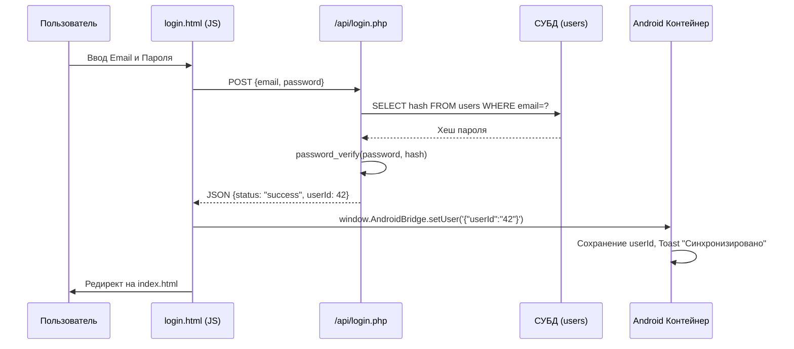

# Технический план: Система Регистрации и Авторизации (005-auth-system)

## 1. Архитектурный стек и Безопасность

Система авторизации реализуется на стороне бэкенда с использованием встроенных механизмов безопасности PHP для работы с сессиями и криптографическими хешами.

### Бэкенд (PHP 8.1+)
- **Хеширование паролей (FR-502):** Функция `password_hash()` с алгоритмом `PASSWORD_BCRYPT`. Проверка через `password_verify()`.
- **Управление сессиями:** Встроенный механизм `session_start()`. При успешном логине в сессию записываются данные пользователя (`user_id`, `name`).
- **Интерфейс:** REST API, возвращающий JSON.

### Фронтенд (JS/HTML)
- **Формы:** Асинхронная отправка данных через `Fetch API`.
- **Синхронизация (FR-504):** После получения успешного JSON-ответа от API, скрипт вызывает метод моста `AndroidBridge.setUser`.

---

## 2. Схема взаимодействия при входе

---

## 3. Фазы реализации

### Фаза 0: Проектирование моделей и схем (Текущая)
- [x] Описание механизмов хеширования и сессий.
- [ ] Описание JSON схем запросов/ответов для Login/Register.

### Фаза 1: Разработка Серверных API эндпоинтов
- Реализация `backend/api/register.php` (Валидация email, хеширование, INSERT).
- Реализация `backend/api/login.php` (Проверка хеша, инициализация PHP сессии).

### Фаза 2: Создание Веб-Интерфейса Авторизации
- Верстка `backend/register.html` и `backend/login.html`.
- Написание JS-логики отправки форм и вызова нативного моста `setUser`.

### Фаза 3: Верификация и тесты безопасности
- Тестирование на надежность (неверные пароли, SQL-инъекции).
- Проверка сквозной синхронизации с Android (появление нативного сообщения при логине в WebView).
