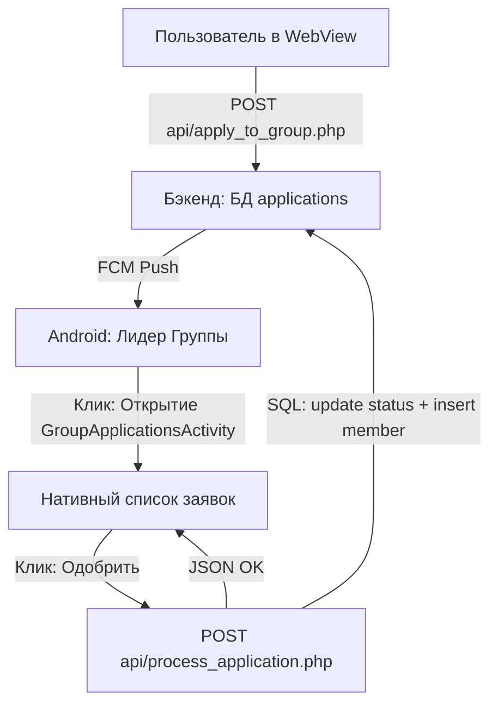

# Технический план: Система заявок на вступление в группу (006-group-applications)

## 1. Архитектурный стек и структура данных

Система заявок строится как сквозной процесс между Веб-фронтендом (подача), Бэкендом (логика и пуши) и Android (управление).

### Бэкенд и СУБД
- **Таблица `applications` (FR-603):** Хранит `user_id`, `group_id`, `status` (pending, approved, rejected).
- **API логика:** Сценарий "Approved" автоматически вызывает `INSERT` в таблицу `group_members` (спроектированную в фиче 004).

### Android (Нативная часть)
- **Экран:** `GroupApplicationsActivity` на Jetpack Compose.
- **Список:** `LazyColumn` с использованием `Modifier.animateItemPlacement()` для плавного удаления элементов.
- **Интеграция:** ViewModel для синхронной обработки транзакций одобрения.

---

## 2. Схема потоков управления

---

## 3. Фазы реализации

### Фаза 0: Проектирование контрактов (Текущая)
- [x] Определение структуры таблицы заявок.
- [ ] Описание JSON-схем для новых API эндпоинтов.

### Фаза 1: Развертывание СУБД и Бэкенд API
- Создание таблицы `applications` в `backend/database.sql`.
- Реализация `api/apply_to_group.php` (Создание + вызов функции пуша).
- Реализация `api/get_applications.php` и `api/process_application.php`.

### Фаза 2: Обновление Веб-интерфейса
- Добавление кнопки "Подать заявку" на страницу `group.html`.
- Написание JS-логики вызова API подачи заявки.

### Фаза 3: Реализация нативного экрана Android
- Создание `GroupApplicationsActivity`.
- Верстка карточки заявки и реализация плавного удаления из списка.
- Интеграция с Интентом пуш-уведомления для прямого перехода к списку.
