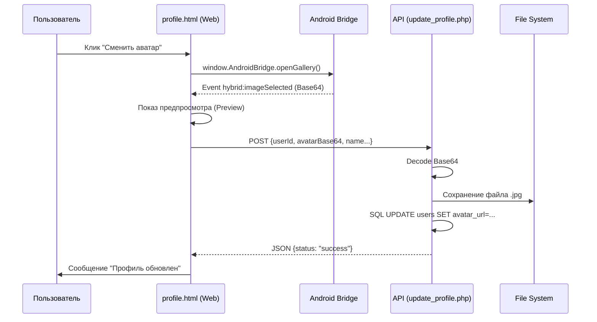

# Технический план: Система «Мой Профиль» и управление аватаром (007-user-profile)

## 1. Архитектурный стек и Обработка данных

Фича реализуется в веб-части с использованием ранее созданных нативных возможностей моста для работы с камерой/галереей.

### Бэкенд (PHP 8.1+)
- **Хранение файлов:** Аватары сохраняются в директорию `backend/assets/avatars/`.
- **Обработка Base64:** API `update_profile.php` принимает строку Base64, декодирует её и сохраняет как файл `.jpg` или `.png`.
- **СУБД:** Обновление полей `name`, `spiritual_name`, `avatar_url` в таблице `users`.

### Фронтенд (JS/HTML)
- **Интеграция с мостом:** Подписка на событие `hybrid:imageSelected` в `profile.html`.
- **Предпросмотр:** Использование `src="data:image/..."` для мгновенного отображения выбранного фото до загрузки на сервер.

---

## 2. Схема движения данных аватара

---

## 3. Фазы реализации

### Фаза 0: Проектирование и СУБД (Текущая)
- [x] Описание схемы сохранения файлов.
- [ ] Модификация таблицы `users`.

### Фаза 1: Бэкенд API и Инфраструктура файлов
- Создание директории `backend/assets/avatars/` и настройка прав доступа.
- Реализация `api/get_profile.php` и `api/update_profile.php`.

### Фаза 2: Веб-Интерфейс Профиля
- Верстка `backend/profile.html`.
- Реализация JS-логики: получение данных профиля при загрузке, обработка события от нативной галереи, отправка данных.

### Фаза 3: Верификация
- Проверка лимитов размера файлов.
- Сквозной тест: Выбор фото в Android -> Отображение в Вебе -> Проверка файла на сервере.
