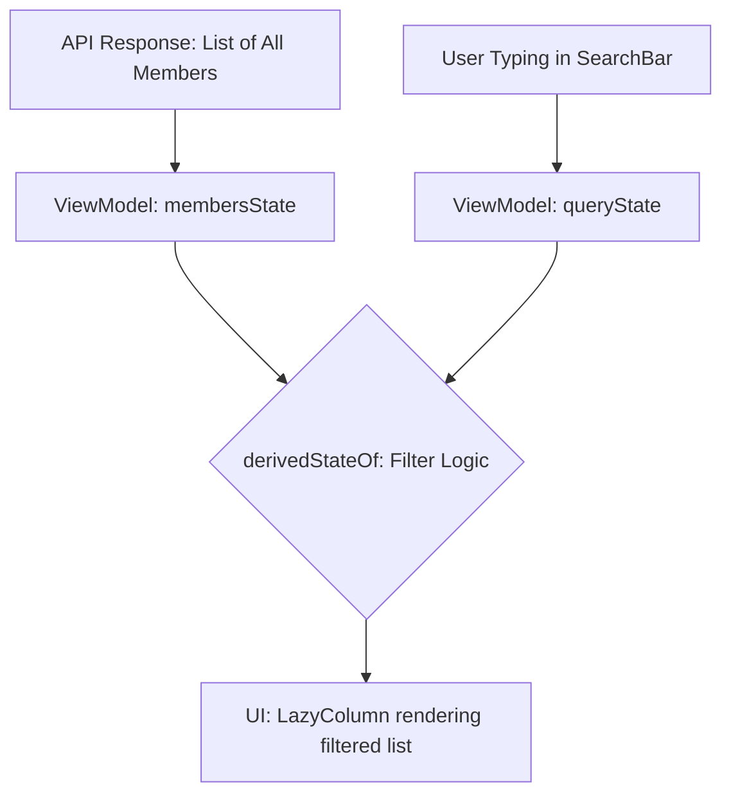

# Технический план: Нативный экран «Участники группы» (008-group-members)

## 1. Технический стек и архитектура UI

Реализация списка участников базируется на высокопроизводительных нативных компонентах для обеспечения мгновенного отклика поиска.

### Нативная часть (Android)
- **Компонент:** `GroupMembersActivity` (Jetpack Compose).
- **Поиск (FR-802):** Использование Material 3 `DockedSearchBar` или `Search interface` для фильтрации списка в реальном времени.
- **Список (FR-801):** `LazyColumn` с оптимизацией стейта через `derivedStateOf` для быстрой фильтрации больших массивов данных в памяти.
- **Аватары:** Продолжение использования библиотеки **Coil** для кэширования фото участников.

### Серверная часть (Бэкенд)
- **Язык эндпоинта:** PHP 8.1+.
- **Интерфейс связи:** REST API GET-запрос `api/get_group_members.php`.

---

## 2. Схема фильтрации в памяти (Client-Side Search)

---

## 3. Этапы и Фазы реализации

### Фаза 0: Проектирование моделей и схем (Текущая)
- [x] Определение архитектуры поиска (в памяти).
- [ ] Фиксация JSON-схемы расширенного списка участников.

### Фаза 1: Разработка Серверного API
- Реализация PHP-скрипта `backend/api/get_group_members.php`.
- Интеграция SQL JOIN запроса к таблицам `group_members`, `users` для получения духовных имен и аватаров.

### Фаза 2: Реализация Нативного Экрана и Поиска
- Создание `GroupMembersActivity.kt` и ViewModel.
- Реализация логики фильтрации: `List.filter { it.name.contains(query) || it.spiritualName.contains(query) }`.
- Верстка карточки участника с иконками ролей (`FR-804`).

### Фаза 3: Верификация
- Тестирование производительности поиска на списке из 100+ участников (`SC-1001`).
- Проверка отображения ролей и духовных имен.
