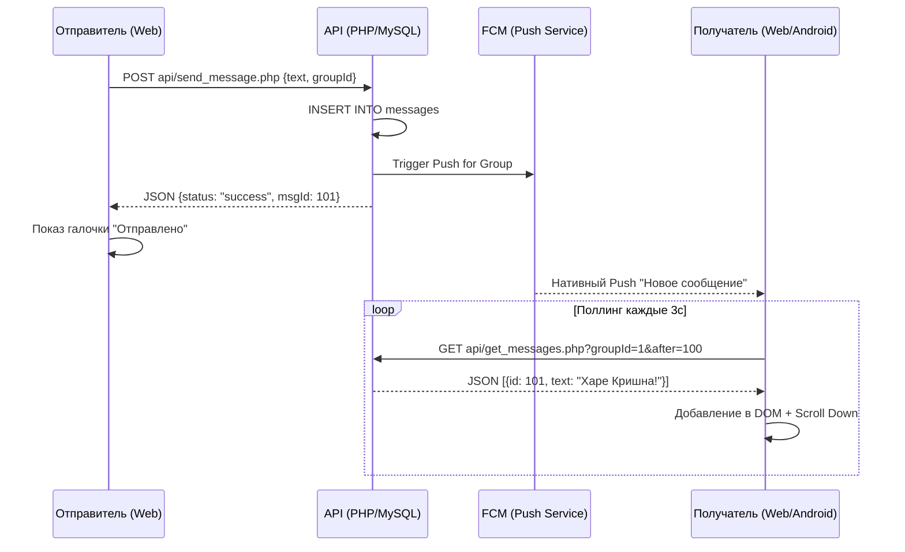

# Технический план: Система обмена сообщениями в группах (009-chat-system)

## 1. Архитектурный стек и логика обновления

Система реализуется на базе REST API с применением оптимизированного поллинга на клиенте для эмуляции реального времени.

### Бэкенд (PHP 8.1+)
- **Таблица `messages` (FR-901):** Связи с `users` и `groups`.
- **API (FR-902, FR-903):** 
    - `send_message.php`: Запись в БД + триггер на отправку пушей.
    - `get_messages.php`: Выборка последних 50 записей с JOIN пользователей для получения имен и аватаров.

### Фронтенд (JS/HTML)
- **Механизм обновления (Scenario 2):** Использование `setInterval` (каждые 3 секунды) для запроса новых сообщений с `id > last_seen_id`.
- **UI:** Плавная прокрутка через `Element.scrollIntoView()`.

---

## 2. Схема движения сообщений

---

## 3. Фазы реализации

### Фаза 1: СУБД и Бэкенд API
- Создание таблицы `messages` в `database.sql`.
- Реализация `api/send_message.php` и `api/get_messages.php`.

### Фаза 2: Обновление Веб-интерфейса чата
- Доработка `backend/group.html`: поле ввода, список сообщений.
- Реализация JS-цикла поллинга и отрисовки сообщений.

### Фаза 3: Верификация
- Тест на скорость доставки между двумя вкладками браузера.
- Проверка автоматической прокрутки при входе.
