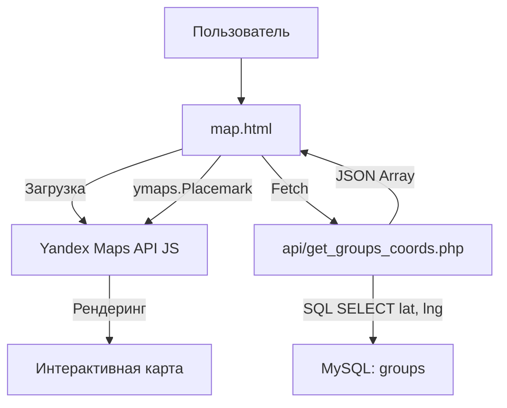

# Технический план: Интеграция Яндекс.Карт и Карта групп (010-maps-integration)

## 1. Технологический стек и Библиотеки

Для реализации карты используется JS API Яндекс.Карт с интеграцией в существующее гибридное окружение.

### Фронтенд (JS/HTML)
- **Библиотека:** `https://api-maps.yandex.ru/2.1/?lang=ru_RU&apikey=YOUR_API_KEY`.
- **Компоненты:** `ymaps.Map`, `ymaps.Placemark`, `ymaps.Clusterer` для группировки меток.
- **Интеграция:** Карта вписывается в блок `
` с адаптивной высотой.

### Бэкенд (PHP 8.1+)
- **API:** Новый эндпоинт `get_groups_coords.php` для отдачи легковесного набора данных для карты.

---

## 2. Архитектура взаимодействия данных

---

## 3. Фазы реализации

### Фаза 0: Проектирование и СУБД (Текущая)
- [x] Определение API и библиотек.
- [ ] Расширение таблицы `groups` полями координат.

### Фаза 1: Серверная часть
- Обновление `database.sql`: добавление `latitude` и `longitude`.
- Реализация `api/get_groups_coords.php`.

### Фаза 2: Веб-Интерфейс Карты
- Создание страницы `backend/map.html`.
- Инициализация Яндекс.Карт, настройка кластеризатора.
- Реализация логики перехвата клика «Подробнее» для работы с нативным мостом.

### Фаза 3: Верификация
- Проверка точности меток.
- Проверка корректности работы жестов зума в Android WebView.
