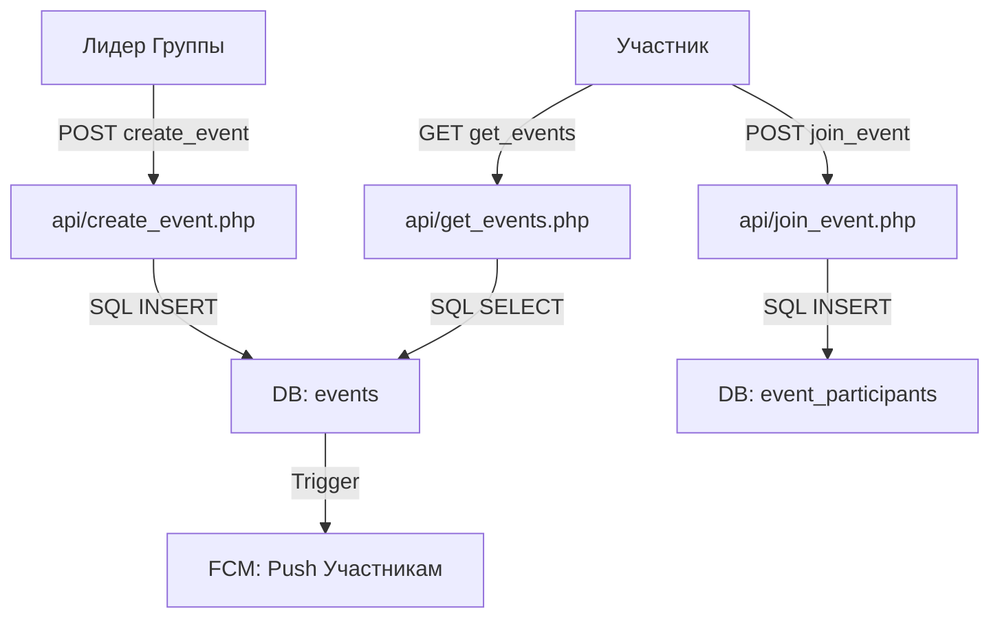

# Технический план: Система управления мероприятиями (011-events-system)

## 1. Технологический стек и База данных

Для реализации системы мероприятий используется существующий PHP/MySQL стек с интеграцией в веб-фронтенд.

### СУБД (MySQL)
- **Таблица `events` (FR-1101):** Хранит `id`, `group_id`, `title`, `description`, `event_date`, `location`.
- **Таблица `event_participants`:** Хранит связку `event_id` и `user_id`.

### Бэкенд (PHP 8.1+)
- **API (FR-1102):**
    - `get_events.php`: Выборка из `events` с JOIN `groups` и фильтром по дате.
    - `create_event.php`: Валидация прав лидера + INSERT в `events`.
    - `join_event.php`: INSERT в `event_participants`.

### Фронтенд (JS/HTML)
- **Страница `events.html`:** Рендеринг списка карточек. Использование `Intl.DateTimeFormat` для локализации дат.

---

## 2. Архитектура взаимодействия

---

## 3. Фазы реализации

### Фаза 1: Развертывание СУБД
- Добавление таблиц `events` и `event_participants` в `database.sql`.

### Фаза 2: Бэкенд API
- Реализация `get_events.php` (агрегация по группам пользователя).
- Реализация `create_event.php` и `join_event.php`.

### Фаза 3: Веб-Интерфейс
- Создание страницы `backend/events.html`.
- Реализация JS-логики загрузки и отметки участия.

### Фаза 4: Верификация
- Тест на создание события и отображение в списке участника.
- Проверка скорости отклика API.
