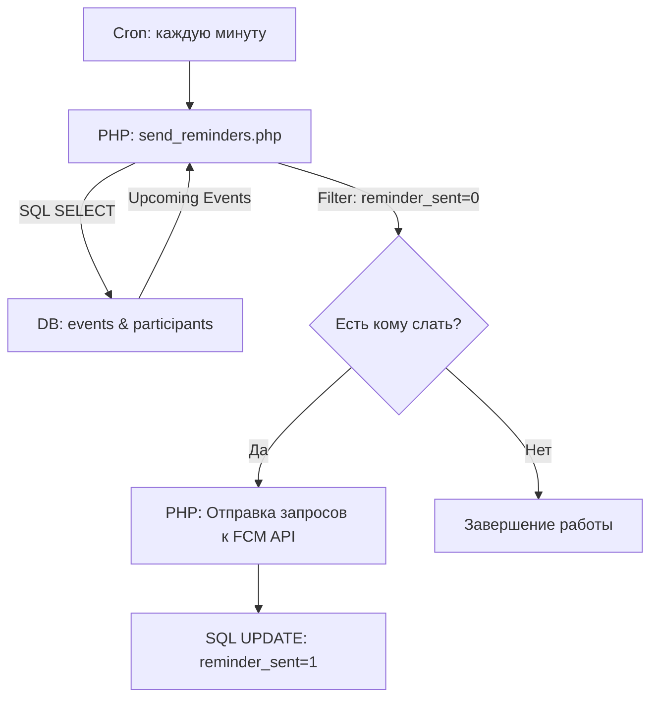

# Технический план: Система напоминаний о мероприятиях (012-event-reminders)

## 1. Архитектура решения

Система строится на базе серверного скрипта, запускаемого по расписанию, который сканирует базу данных и отправляет запросы в Firebase Cloud Messaging.

### Бэкенд (PHP 8.1+)
- **Скрипт-воркер:** `backend/cron/send_reminders.php`.
- **Логика выбора:** Поиск записей в `event_participants` + `events`, где `event_date` наступает через 58-62 минуты, и флаг `reminder_sent` в таблице участников равен `false`.
- **FCM API:** Отправка POST-запросов к серверу Google.

### СУБД (MySQL)
- **Таблица `event_participants`:** Добавление колонки `reminder_sent` (TINYINT) для трекинга статуса отправки.

### Android
- Использование существующей `MyFirebaseMessagingService.kt` для парсинга payload и вывода сообщения.

---

## 2. Схема работы Cron-задачи

---

## 3. Фазы реализации

### Фаза 1: Модификация СУБД
- Добавление поля `reminder_sent` в таблицу `event_participants`.

### Фаза 2: Серверный скрипт
- Разработка `backend/cron/send_reminders.php`.
- Реализация логики выборки участников предстоящих событий.
- Настройка вызова функции отправки пуша (FCM).

### Фаза 3: Верификация
- Эмуляция времени события в БД.
- Ручной запуск скрипта и проверка получения пуша на устройстве.
