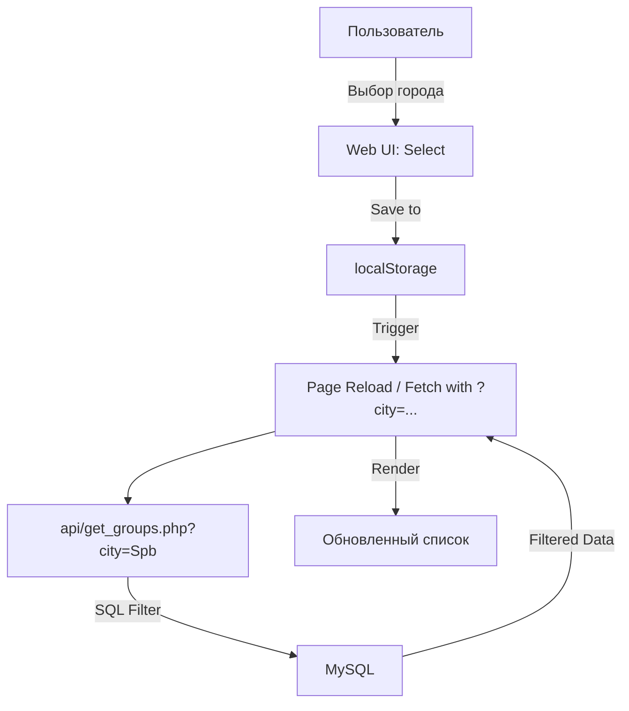

# Технический план: Поиск и фильтрация по городам (013-city-filter)

## 1. Архитектура фильтрации

Фильтрация реализуется как сквозной параметр, передаваемый от клиента к API.

### Бэкенд (PHP 8.1+)
- **Новый эндпоинт:** `api/get_cities.php` (SELECT DISTINCT city FROM groups).
- **Модификация существующих API:** Добавление условия `WHERE city = :city` в SQL запросы.

### Фронтенд (JS/HTML)
- **Хранилище:** Глобальная переменная `currentCity` в `localStorage`.
- **UI:** Выпадающий список в шапке `index.html`, `map.html` и `events.html`.
- **Синхронизация:** При изменении города вызываются функции перезагрузки контента для текущей страницы.

---

## 2. Схема взаимодействия

---

## 3. Фазы реализации

### Фаза 1: Бэкенд и API
- Реализация `api/get_cities.php`.
- Обновление `api/get_groups_coords.php` и `api/get_events.php` для поддержки фильтра по городу.

### Фаза 2: Веб-Интерфейс
- Создание компонента выбора города (JS/HTML).
- Интеграция фильтра во все основные страницы.
- Реализация логики сохранения в `localStorage`.

### Фаза 3: Гео-интеграция
- Доработка `map.html`: при смене города — геокодирование или центрирование карты по первой найденной метке города.

### Фаза 4: Верификация
- Проверка сохранения города после перезагрузки.
- Тест скорости фильтрации.
