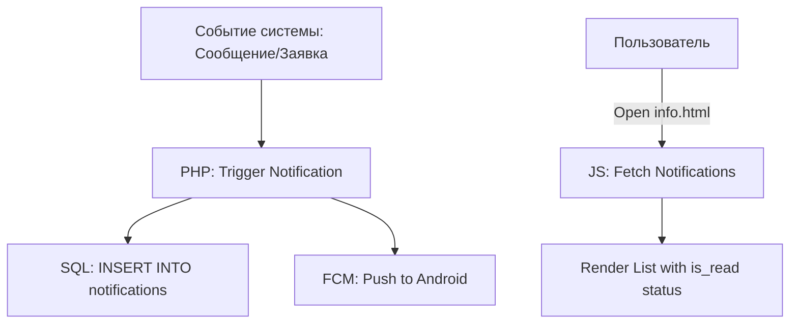

# Технический план: Инфо-центр и Центр уведомлений (014-info-and-notifications)

## 1. Архитектура и СУБД

Для полной идентичности оригиналу мы внедряем таблицы уведомлений и обработчик информационных данных.

### СУБД (MySQL)
- **Таблица `notifications` (FR-1402):**
    - `id` (INT), `user_id` (INT), `type` (VARCHAR), `title` (VARCHAR), `message` (TEXT), `target_url` (VARCHAR), `is_read` (TINYINT), `created_at` (TIMESTAMP).
- **Таблица `info_articles` (Опционально):** Хранение контента базы знаний.

### Бэкенд (PHP 8.1+)
- **Центр уведомлений:** Эндпоинты `get_notifications.php`, `mark_notification_read.php`.
- **Инфо-обработчик:** `info_handler.php` для отдачи структурированного текста инструкций.

### Фронтенд (JS/HTML)
- **Страница `info.html`:** Рендеринг Apple-style карточек.
- **Индикатор:** Динамический бейдж на иконке чата или колокольчика.

---

## 2. Схема работы уведомлений

---

## 3. Фазы реализации

### Фаза 1: СУБД и Бэкенд API
- Обновление `database.sql`: создание таблицы `notifications`.
- Реализация API для работы с историей уведомлений.
- Реализация `info_handler.php`.

### Фаза 2: Веб-Интерфейс
- Создание страницы `backend/info.html` в оригинальном дизайне.
- Добавление всплывающего окна уведомлений.
- Интеграция бейджей в `bottom-bar`.

### Фаза 3: Верификация
- Проверка появления уведомления в списке после отправки сообщения.
- Проверка скорости загрузки статей.
