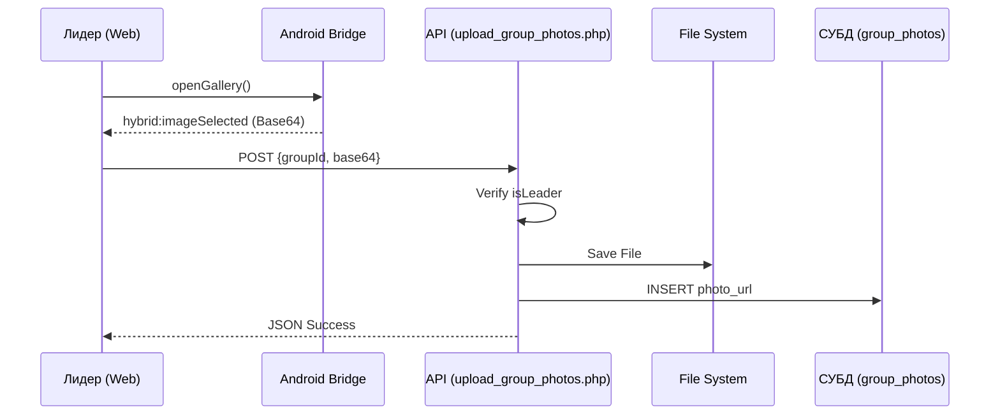

# Технический план: Панель управления лидером (015-leader-panel)

## 1. Архитектура и Безопасность

Панель лидера реализуется как расширенный веб-интерфейс с жесткой проверкой прав доступа на стороне сервера.

### Бэкенд (PHP 8.1+)
- **Middleware прав доступа:** Функция проверки `checkIsLeader($groupId)` перед выполнением любых операций UPDATE/INSERT/DELETE.
- **Обработка фото:** Адаптация логики из Фичи 007 для сохранения фото группы в `assets/photos/`.
- **СУБД:** Массовое управление записями в `group_members` и `group_photos`.

### Фронтенд (JS/HTML)
- **Страница `leader.html`:** Табированный интерфейс (Инфо | Участники | Фото).
- **Интеграция с мостом:** Вызов `openGallery()` и прослушивание события `hybrid:imageSelected` для загрузки новых фото группы.

---

## 2. Схема управления фотографиями

---

## 3. Фазы реализации

### Фаза 1: Бэкенд API и Безопасность
- Реализация эндпоинтов `update_group_info.php`, `upload_group_photos.php`, `delete_group_photo.php`.
- Написание логики `remove_member.php`.

### Фаза 2: Веб-Интерфейс Панели Лидера
- Создание страницы `backend/leader.html`.
- Реализация JS-логики загрузки текущих данных группы и управления разделами.
- Интеграция с нативным мостом для фото.

### Фаза 3: Верификация
- Тест на права доступа (запрет входа не лидерам).
- Проверка удаления участников и очистки фото.
