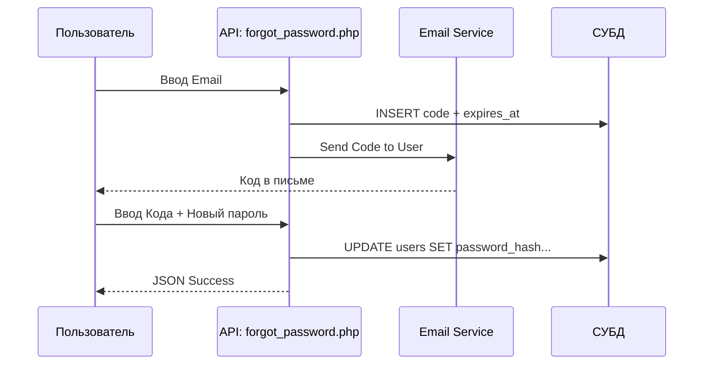

# Технический план: Персонализация и Восстановление (017-personalization-and-recovery)

## 1. Архитектура персонализации

Темы реализуются через инъекцию инлайновых стилей в корневой элемент `#app` на основе данных из БД.

### Бэкенд (PHP 8.1+)
- **Таблица `user_themes`:** `user_id` (PK), `bg_type` (enum), `bg_value` (string).
- **Восстановление:** Использование `mail()` или SMTP для отправки кодов.

### Фронтенд (JS)
- **theme.js:** Функция `applyUserTheme()`, которая вызывается в шапке каждой страницы для предотвращения мерцания.

---

## 2. Схема восстановления доступа

---

## 3. Фазы реализации

### Фаза 1: СУБД и Темы
- Создание таблицы `user_themes`.
- Реализация API получения и сохранения тем.
- Обновление `theme.js` для работы с БД.

### Фаза 2: Восстановление и Email
- Создание таблицы `password_resets`.
- Реализация `forgot_password.php` и формы на фронтенде.

### Фаза 3: Дополнительные функции
- Реализация `leave_group.php`.
- Интеграция кнопок управления в профиль и группы.
