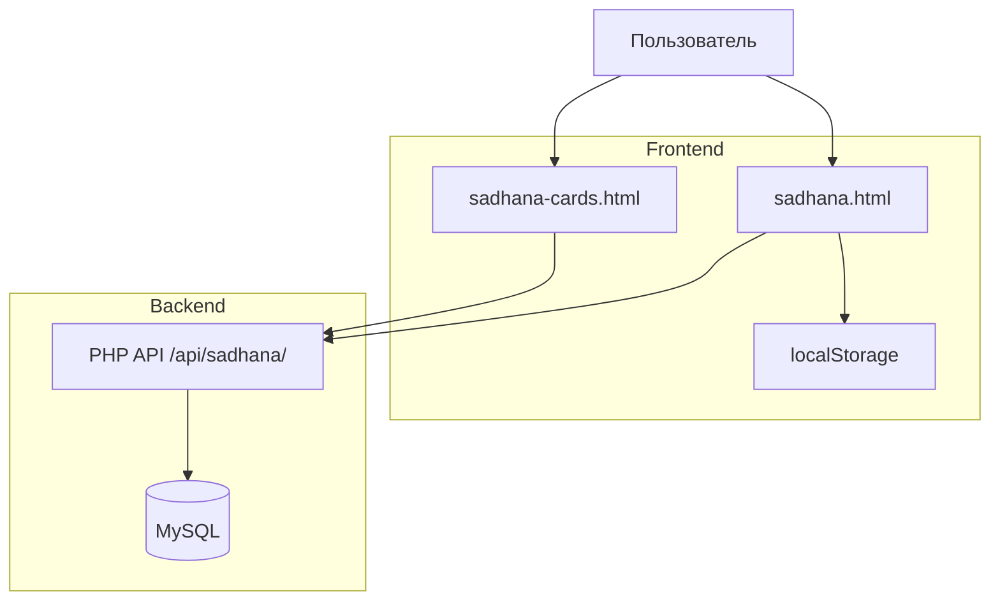

# Технический план: Отслеживание садханы (020-sadhana-tracking)

## 1. Технологический стек и архитектура

Проект использует традиционный LAMP-стек (Apache + PHP + MySQL) с vanilla HTML/CSS/JavaScript фронтендом. Фронтенд садханы — два HTML-файла, обслуживаемые Apache напрямую. Бэкенд — PHP API в директории `api/`.

### Фронтенд
- **Технология:** Vanilla HTML5 + CSS3 + JavaScript (ES6+)
- **Файлы:** `sadhana.html` (дневной лог), `sadhana-cards.html` (управление карточками)
- **Стилизация:** CSS Custom Properties, CSS Grid, Flexbox, медиа-запросы
- **Адаптивность:** Mobile-first, responsive breakpoints

### Breakpoints
| Брейкпоинт | Устройства | Layout |
|------------|-----------|--------|
| < 768px | Мобильные | Single column, full-width cards |
| 768–1023px | Планшеты | Single column, wider cards |
| ≥ 1024px | Десктоп | Centered column max-width 1200px |
| ≥ 1440px | Wide desktop | Two-column cards grid on cards page |

### Бэкенд (требуется реализация)
- **Технология:** PHP 8+
- **Директория:** `api/sadhana/`
- **Протокол:** REST JSON over HTTPS
- **Аутентификация:** Заголовок `X-User-Id`

---

## 2. Архитектура взаимодействия (Компоненты)

---

## 3. Модель данных

### Таблица `sadhana_cards` (карточки практик)
| Колонка | Тип | Описание |
|---------|-----|----------|
| `id` | INT PK | Идентификатор |
| `user_id` | VARCHAR(100) | ID пользователя |
| `name` | VARCHAR(200) | Название практики |
| `type` | ENUM('COUNT','DURATION') | Тип |
| `target_value` | DECIMAL(10,2) | Целевое значение |
| `unit` | VARCHAR(50) | Единица измерения |
| `is_archived` | TINYINT(1) | Статус архива |
| `created_at` | TIMESTAMP | Дата создания |
| `updated_at` | TIMESTAMP | Дата обновления |

### Таблица `sadhana_daily_logs` (дневные логи)
| Колонка | Тип | Описание |
|---------|-----|----------|
| `id` | INT PK | Идентификатор |
| `user_id` | VARCHAR(100) | ID пользователя |
| `date` | DATE | Дата лога |
| `card_id` | INT FK | Ссылка на карточку |
| `actual_value` | DECIMAL(10,2) | Фактическое значение |
| `books` | TEXT | JSON-массив книг |

### Таблица `sadhana_sleep_logs` (режим сна)
| Колонка | Тип | Описание |
|---------|-----|----------|
| `id` | INT PK | Идентификатор |
| `user_id` | VARCHAR(100) | ID пользователя |
| `date` | DATE | Дата |
| `bed_time` | TIME | Время отбоя |
| `wake_time` | TIME | Время подъёма |

---

## 4. API Endpoints

| Method | Endpoint | Описание |
|--------|----------|----------|
| GET | `/api/sadhana/cards` | Получить карточки пользователя |
| POST | `/api/sadhana/cards` | Создать новую карточку |
| PATCH | `/api/sadhana/cards/{id}/archive` | Архивировать карточку |
| POST | `/api/sadhana/cards/{cardId}/logs` | Сохранить лог практики |
| POST | `/api/sadhana/sleep` | Сохранить лог сна |

---

## 5. Этапы и фазы реализации

### Фаза 0: Авторизация и привязка к пользователю
- [ ] Реализовать функцию `getCurrentUserId()` для получения USER_ID из текущей сессии
- [ ] Проверка авторизации при загрузке страниц садханы
- [ ] Обработка неавторизованного пользователя (модалка или редирект)

### Фаза 1: Миграции БД
- [ ] Создание SQL-миграций для таблиц `sadhana_cards`, `sadhana_daily_logs`, `sadhana_sleep_logs`

### Фаза 1: Backend API
- [ ] Создание `api/sadhana/` директории
- [ ] Реализация endpoints для CRUD карточек
- [ ] Реализация endpoints для сохранения логов практик и сна

### Фаза 2: Frontend интеграция
- [ ] Обновление `sadhana.html` для работы с реальным API (загрузка данных за прошлые дни)
- [ ] Обновление `sadhana-cards.html` для загрузки существующих карточек с сервера
- [ ] Тестирование полного цикла: создание карточки → лог → сохранение

### Фаза 3: Адаптивный дизайн (Responsive)
- [ ] Вынести инлайн-стили из HTML в отдельный CSS-файл `sadhana.css`
- [ ] Добавить mobile-first базовые стили (current 480px layout)
- [ ] Добавить медиа-запросы для desktop (≥1024px): центрирование, max-width, padding
- [ ] На странице cards: двухколоночный layout на wide screens (≥1440px)
- [ ] Тестирование на реальных устройствах / browser dev tools

### Фаза 4: Тестирование и полировка
- [ ] Тестирование edge cases (переход через полночь, пустые данные, сетевые ошибки)
- [ ] Проверка резервного localStorage сохранения
